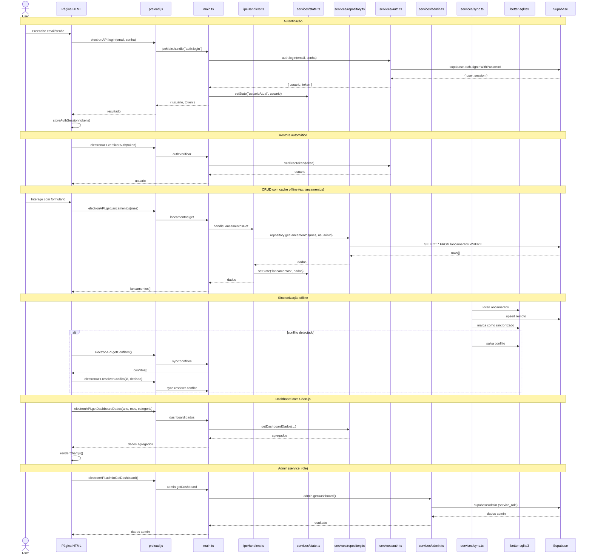

# Arquitetura — Finanças Pessoais

## Stack

| Camada                | Tecnologia                                          | Sandbox                        |
| --------------------- | --------------------------------------------------- | ------------------------------ |
| Processo principal    | TypeScript → CJS (Electron 39, compilado via `tsc`) | Acesso total ao sistema        |
| Processo renderizador | JavaScript ESM (sem framework)                      | sandbox, sem `nodeIntegration` |
| Banco remoto          | Supabase (PostgreSQL)                               | —                              |
| Banco local           | better-sqlite3 (WAL, cache offline)                 | —                              |
| Chart                 | Chart.js (bundlado em `node_modules/`)              | —                              |
| Ícones                | FontAwesome (bundlado em `public/fontawesome/`)     | —                              |
| Testes JS             | Vitest v4                                           | —                              |

## Visão geral

O Finanças Pessoais segue a arquitetura **Electron com contextIsolation**. Todo o código de negócio vive no **main process** (`services/`), nunca exposto ao DevTools. O renderer se comunica exclusivamente via **IPC** através de uma ponte segura (`preload.js` → `window.electronAPI`).

```
┌───────────────────────────────────────────────────────────────────────────────────────────┐
│                                       Main Process                                        │
│ ┌──────────┐  ┌──────────┐  ┌────────────┐  ┌────────────────┐  ┌──────────────┐          │
│ │ auth.ts  │  │ admin.ts │  │ conexao.ts │  │ repository.ts  │  │ database.ts  │          │
│ │          │  │          │  │ (Supabase) │  │ (CRUD + enc)   │  │ (SQLite WAL) │          │
│ └────┬─────┘  └────┬─────┘  └────────────┘  └───────┬────────┘  └──────┬───────┘          │
│      │             │                                │                  │                  │
│ ┌────▼─────────────▼────────────────────────────────▼──────────────────▼────────────────┐ │
│ │                                   ipcHandlers.ts                                      │ │
│ │                      (registra ipcMain.handle para cada canal)                        │ │
│ └──────────────────────────────────────────┬────────────────────────────────────────────┘ │
│                                             │                                             │
│ ┌───────────────────────────────────────────▼───────────────────────────────────────────┐ │
│ │                                       state.ts                                        │ │
│ │                    (estado centralizado + notify via IPC broadcast)                   │ │
│ └───────────────────────────────────────────┬───────────────────────────────────────────┘ │
│                                             │                                             │
│ ┌───────────────────────────────────────────▼───────────────────────────────────────────┐ │
│ │                                       sync.ts                                         │ │
│ │               (sincronização offline bidirecional com Supabase)                       │ │
│ └───────────────────────────────────────────────────────────────────────────────────────┘ │
│                                             │ IPC (contextBridge)                         │
├─────────────────────────────────────────────┼─────────────────────────────────────────────┤
│                                     Renderer (sandbox)                                    │
│ ┌───────────────────────────────────────────▼───────────────────────────────────────────┐ |
│ │                                       preload.ts                                      │ │
│ │                     window.electronAPI (65 métodos IPC)                               │ │
│ └─────┬──────────────┬──────────────┬──────────────┬─────────────┬────────────────┬─────┘ │
│ ┌─────▼────┐ ┌───────▼──────┐ ┌─────▼───────┐ ┌────▼─────┐ ┌─────▼────────┐ ┌─────▼──────┐│
│ │ login.js │ │ index.js    │ │ dashbord.js │ │ admin.js │ │ conflitos.js │ │configura-  ││
│ │          │ │              │ │ +Chart      │ │          │ │ (sync)       │ │ coes.js    ││
│ └──────────┘ └──────────────┘ └─────────────┘ └──────────┘ └──────────────┘ └────────────┘│
│ ┌────────────┐ ┌────────────────────────┐                                                 │
│ │redefinir.js│ │visualizar-cliente.js   │                                                 │
│ │            │ │visualizar-dashboard-   │                                                 │
│ └────────────┘ │ cliente.js             │                                                 │
│                └────────────────────────┘                                                 │
└───────────────────────────────────────────────────────────────────────────────────────────┘
```

## Fluxo de dados



## State Pattern

O estado centralizado em `services/state.ts` usa um padrão de **setState + notify** via IPC broadcast.

### Main process — `services/state.ts`

```js
let state = {
  categorias: [],
  subcategorias: [],
  contas: [],
  pessoas: [],
  lancamentos: [],
  orcamento: [],
  dashboard: null,
  usuarioAtual: null,
};
```

| Método               | Descrição                                                           |
| -------------------- | ------------------------------------------------------------------- |
| `setState(key, val)` | Atualiza `state[key]` e emite `state:updated` para todas as janelas |
| `getState(key)`      | Retorna `state[key]` (ou state inteiro se key omitida)              |
| `resetState()`       | Zera todas as chaves (usado no logout)                              |

### Notify pattern

Após cada `setState`, o `notify()` percorre todas as janelas via `BrowserWindow.getAllWindows()` e envia `webContents.send("state:updated", { key, value })`. O renderer **não** mantém um mirror síncrono — cada página busca os dados atualizados via IPC quando necessário.

```
Renderer                          Main Process
   │                                    │
   ├── getLancamentos(mes) ────────────>│
   │                                    ├── repository.getLancamentos(...)
   │                                    ├── setState("lancamentos", dados)
   │                                    ├── notify("state:updated", ...)
   │<────────── dados ──────────────────┤
   │                                    │
   └── (outra janela) <── state:updated (broadcast)
```

### IPC bridge — `preload.ts`

Arquivo **CommonJS** compilado (exigido pelo Electron). Usa `contextBridge.exposeInMainWorld` para expor o objeto `window.electronAPI` com **65 métodos IPC**. Cada método é um `ipcRenderer.invoke` para um canal correspondente no main process, totalizando **63 canais** registrados via `ipcMain.handle`.

Há também um segundo preload `dialog-senha-preload.ts` (carregado em janela modal) que expõe `window.electronDialog` com métodos `confirmar(senha)` e `cancelar()`.

## Autenticação

### Fluxo de login

1. Renderer chama `electronAPI.login(email, senha)`
2. Main delega para `auth.ts`, que chama `supabase.auth.signInWithPassword`
3. Token e refresh token retornados ao renderer, que armazena em `sessionStorage` / `localStorage`
4. `auth-guard.js` gerencia: `ensureAuthenticated()`, `renewFromRefreshToken()`, `clearAuthSession()`

### Recuperação de senha via deep link

1. Renderer chama `electronAPI.solicitarRecuperacao(email)` → Supabase envia e-mail
2. Usuário clica no link → protocolo `financasapp://` abre o app
3. `main.ts` processa o deep link, extrai `access_token`, verifica com `auth.verificarToken`
4. Redireciona para `redefinir.html` onde usuário define nova senha
5. `promptSenha()` abre janela modal com `dialog-senha-preload.ts` para confirmar senha atual em ações sensíveis

### Tokens

| Storage          | Chave                    | Uso                         |
| ---------------- | ------------------------ | --------------------------- |
| `sessionStorage` | `financas.access_token`  | Token JWT da sessão atual   |
| `localStorage`   | `financas.refresh_token` | Refresh token (remember me) |
| `sessionStorage` | `financas.user`          | Dados do usuário logado     |

## Navegação entre páginas

Cada página HTML carrega seu próprio módulo JS via `<script type="module">`:

| Página                              | Módulo JS                         | Rota de acesso                 |
| ----------------------------------- | --------------------------------- | ------------------------------ |
| `login.html`                        | `login.js`                        | Ponto de entrada               |
| `index.html`                        | `index.js`                        | Página principal do app        |
| `dashboard.html`                    | `dashboard.js` + Chart.js         | `/dashboard`                   |
| `conflitos.html`                    | `conflitos.js`                    | Resolução de conflitos de sync |
| `admin.html`                        | `admin.js`                        | `/admin` (role=admin)          |
| `configuracoes.html`                | `configuracoes.js`                | `/config`                      |
| `redefinir.html`                    | `redefinir.js`                    | Deep link recuperação          |
| `visualizar-cliente.html`           | `visualizar-cliente.js`           | Admin: detalhes cliente        |
| `visualizar-dashboard-cliente.html` | `visualizar-dashboard-cliente.js` | Admin: dashboard cliente       |

Todas as páginas (exceto login) chamam `ensureAuthenticated()` do `auth-guard.js` no `DOMContentLoaded`. Se o token expirou, tentam renovação silenciosa via `renewFromRefreshToken()`. Se falha, redirecionam para `login.html`.

## Serviços do main process (`services/`)

| Arquivo          | Responsabilidade                                                         |
| ---------------- | ------------------------------------------------------------------------ |
| `state.ts`       | Estado centralizado + notify via IPC broadcast                           |
| `repository.ts`  | Todas as queries Supabase (CRUD + criptografia AES-256 de campos)        |
| `ipcHandlers.ts` | Registro centralizado de todos os handlers IPC (63 canais)               |
| `auth.ts`        | Autenticação: login, verificação, refresh, recuperação de senha          |
| `admin.ts`       | Operações administrativas (dashboard admin, gestão de clientes)          |
| `conexao.ts`     | Cliente Supabase singleton + monitor de conectividade + EventEmitter     |
| `database.ts`    | Banco SQLite local (WAL, integridade, migrações)                         |
| `sync.ts`        | Sincronização offline bidirecional com Supabase + resolução de conflitos |

### `conexao.ts`

Único ponto com URL e chaves do Supabase:

- `supabase` — client anon (RLS ativo, operações do usuário)
- `supabaseAdmin` — client service_role (operações administrativas, auth schema)
- Lê `SUPABASE_SERVICE_ROLE` do `.env` (nunca sai do main process)
- `iniciarMonitoramento()` / `pararMonitoramento()` — checa conectividade a cada 30s e emite eventos via `EventEmitter`
- `isOnline()` / `estaOnline()` — status atual da conexão

### `repository.ts`

- Contém ~1050 linhas com todos os CRUDs do sistema
- Implementa criptografia AES-256-GCM via `crypto.createCipheriv` para campos sensíveis (dados bancários, tokens)
- Chave derivada de `ENCRYPTION_KEY || SUPABASE_URL` via SHA-256
- Funções `setAuthSession`/`clearAuthSession` gerenciam sessão do cliente anon para RLS

### `database.ts`

- Gerencia banco SQLite local via `better-sqlite3` (WAL, `synchronous = NORMAL`, `busy_timeout = 5000`)
- `iniciar(userDataPath)` — abre banco com verificação de integridade; recria automaticamente se corrompido
- `executar(sql, params)` — executa queries parametrizadas
- `executarMany(sql, params)` — batch insert/update
- Banco usado como cache offline e fonte primária para operações sem internet

### `sync.ts`

- Sincronização bidirecional entre SQLite local e Supabase
- Push a cada 60s (`INTERVALO_PUSH_MS`), pull a cada 120s (`INTERVALO_PULL_MS`)
- Entidades sincronizadas: `categorias`, `subcategorias`, `contas`, `pessoas`, `lancamentos`, `orcamento`, `chamados`
- Detecção e resolução de conflitos (última escrita vence ou intervenção manual via `conflitos.html`)
- `forceSync()` — gatilho manual, `getStatus()` — status atual da sincronização

### `auth.ts`

- `login()` — `supabase.auth.signInWithPassword`, cria sessão no Supabase
- `verificarToken()` — `supabase.auth.getUser`, retorna dados do perfil
- `renovarSessao()` — `supabase.auth.refreshSession`
- `solicitarRecuperacao()` — `supabase.auth.resetPasswordForEmail`
- `trocarSenha()` — verifica senha atual via promptSenha, depois altera
- `getRecoveryTokens()`/`setRecoveryTokens()` — gerencia tokens de recuperação recebidos via deep link com expiração de 5 min

### `admin.ts`

- Operações que exigem `service_role` key (acesso ao schema `auth.users`)
- `getDashboard()` — contagem de clientes, chamados abertos, etc.
- `getClientes()` — lista todos os usuários
- `getTransacoesCliente()`, `getDashboardDadosCliente()` — dados de um cliente específico
- `resetSenha()` — altera senha via admin `auth.admin.updateUserById`
- `criarUsuario()` — cria usuário via `auth.admin.createUser`
- `getChamados()`/`responderChamado()` — gestão de chamados de suporte

## Módulos do renderer (`public/js/`)

| Arquivo                           | Responsabilidade                                                                 |
| --------------------------------- | -------------------------------------------------------------------------------- |
| `auth-guard.js`                   | Guard de autenticação (verificação, refresh, store de tokens)                    |
| `toast.js`                        | Notificações toast + diálogo de confirmação modal                                |
| `helper.js`                       | `formatarMoeda()` — formatação pt-BR                                             |
| `csv.js`                          | Exportação CSV (template + conversão, delimitador tabulação)                     |
| `password-utils.js`               | Utilitários de validação de senha                                                |
| `login.js`                        | Tela de login (splash, formulário, remember me)                                  |
| `index.js`                        | Página principal: CRUD de lançamentos, orçamento, transferências, importação CSV |
| `dashboard.js`                    | Dashboard financeiro com Chart.js (mensal, categorias, saldo)                    |
| `conflitos.js`                    | Resolução de conflitos de sincronização (decisão manual)                         |
| `admin.js`                        | Painel admin: clientes, chamados, categorias globais, auditoria                  |
| `configuracoes.js`                | Perfil, sessões ativas, exportar dados, excluir conta                            |
| `redefinir.js`                    | Redefinição de senha via deep link                                               |
| `visualizar-cliente.js`           | Admin: detalhes financeiros de um cliente                                        |
| `visualizar-dashboard-cliente.js` | Admin: dashboard personalizado de um cliente                                     |

## Segurança

- `contextIsolation: true`, `nodeIntegration: false` em todas as janelas
- `preload.js` expõe apenas `window.electronAPI` via `contextBridge`
- `dialog-senha-preload.js` expõe apenas `window.electronDialog`
- CSP (Content-Security-Policy) definido via `<meta>` em cada página HTML:
  `default-src 'self'; script-src 'self'; style-src 'self' 'unsafe-inline'; img-src 'self' data: https:; font-src 'self'; connect-src 'self' https://lsjoopdtjjadfoqsaasu.supabase.co`
- `.env` com chave `SUPABASE_SERVICE_ROLE` fica no main process
- RLS ativado em todas as tabelas do Supabase
- Service role key usada apenas no backend admin (`admin.js`); anon key é usada no client normal
- Criptografia AES-256-GCM para dados sensíveis em `repository.js` (chave derivada, nunca armazenada)
- Deep links validam token antes de redirecionar (`main.ts`)
- Diálogo modal de senha (`promptSenha`) para ações destrutivas (trocar senha, excluir conta)

## Referência completa de IPC

Ver `docs/ipc-reference.md` para o catálogo completo dos 63 canais IPC.
