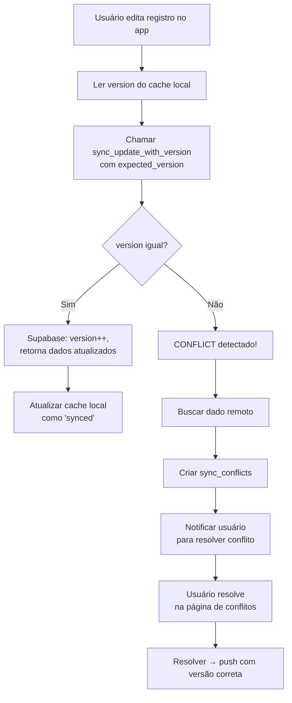

# Fluxo de Validação de Conflitos de Sincronia

## 1. Arquitetura Atual

```
App (Online)
  ├── write ──→ Supabase direto (sem version check) ──→ sync_status = 'synced'
  └── read  ──→ SQLite local (cache) ←── pull (sobrescreve se local não for pending/conflict)

App (Offline)
  ├── write ──→ SQLite local ──→ sync_status = 'pending'
  └── sync push ──→ Supabase via sync_upsert RPC (com version check)
                      └── CONFLICT → sync_conflicts table
```

## 2. O Problema

**Quando o app está online, as escritas vão direto para o Supabase SEM verificação de versão.** O `updateLancamento()` (em `services/repository/lancamentos.ts:335-352`) faz:

```
1. _atualizarLocal(... sync_status: 'pending')
2. supabase.from(...).update(payload)  ← sem expected_version
3. _atualizarLocal(... sync_status: 'synced')
```

Isso significa que se o usuário alterar um valor manualmente no Supabase, a próxima escrita do app **simplesmente sobrescreve sem detectar conflito**.

**No pull**, o sync engine (`services/sync.ts:255-295`) também não compara versões — só ignora registros que estão `pending` ou `conflict` no local, e sobrescreve o resto.

## 3. Fluxo de Detecção de Conflito (Atual — só funciona offline)

```mermaid
flowchart TD
    A[Registro alterado offline] --> B[sync_status = 'pending']
    B --> C[push() via sync_upsert RPC]
    C --> D{version local == version remota?}
    D -->|Sim| E[Atualiza Supabase + version++]
    D -->|Não| F[CONFLICT - raise exception]
    F --> G{Entidade crítica?}
    G -->|Sim| H[Marca sync_status = 'conflict']
    H --> I[Cria registro em sync_conflicts]
    G -->|Não| J[Last-write-wins por timestamp]
    J --> K{remoto mais novo?}
    K -->|Sim| L[Sobrescreve local com remoto]
    K -->|Não| M[Tenta push novamente com nova version]
```

## 4. Rotas de Escrita no App

| Operação | Arquivo | Estratégia | Detecta conflito? |
|---|---|---|---|
| `createLancamento` | `repository/lancamentos.ts:294` | Insere direto no Supabase + cache local | N/A (insert) |
| `updateLancamento` | `repository/lancamentos.ts:335` | Update direto no Supabase + cache local | ❌ **Não** |
| `deleteLancamento` | `repository/lancamentos.ts:322` | Soft-delete + pending → sync_delete | Apenas no push offline |
| `createTransferencia` | `repository/lancamentos.ts:354` | Insert direto no Supabase | N/A (insert) |
| `updateTransferencia` | `repository/lancamentos.ts:424` | Update direto no Supabase | ❌ **Não** |
| `createCategoria` | `repository/categorias.ts` | Insert/update direto no Supabase | ❌ **Não** |
| `updateCategoria` | `repository/categorias.ts` | Update direto no Supabase | ❌ **Não** |
| `createConta` | `repository/contas.ts` | Insert/update direto no Supabase | ❌ **Não** |
| `updateConta` | `repository/contas.ts` | Update direto no Supabase | ❌ **Não** |
| `createPessoa` | `repository/pessoas.ts` | Insert/update direto no Supabase | ❌ **Não** |
| `updatePessoa` | `repository/pessoas.ts` | Update direto no Supabase | ❌ **Não** |

## 5. Causa Raiz

Todas as operações **online** bypassam o `sync_upsert` RPC (que faz o version check). Elas usam o cliente Supabase direto, que não tem o parâmetro `expected_version`.

Para detectar conflito, a escrita **precisa** passar pelo `sync_upsert` RPC com o `expected_version` correto, ou fazer um **compare-and-swap** manual:

```sql
UPDATE financas_lancamentos
SET version = version + 1, ...
WHERE id = $1 AND version = $2
-- se row_count = 0 → CONFLICT
```

## 6. Solução Proposta

### 6.1 Criar RPC `sync_update_with_version`

```sql
CREATE OR REPLACE FUNCTION sync_update_with_version(
  registro_id UUID,
  expected_version INT,
  tabela TEXT,
  payload JSONB
) RETURNS JSONB
LANGUAGE plpgsql SECURITY DEFINER
SET search_path = public AS $$
DECLARE
  v_linhas INT;
  v_resultado JSONB;
  v_sets TEXT;
  v_sql TEXT;
BEGIN
  -- Mesma lógica do sync_upsert mas SEM incrementar version
  -- (o incremento já foi feito no local_updated_at)

  SELECT string_agg(format('%I = $3->>%L', key, key), ', ')
  INTO v_sets
  FROM jsonb_object_keys(payload) AS key
  WHERE key NOT IN ('id', 'version');

  v_sql := format(
    'UPDATE %I SET %s, version = version + 1 WHERE id = $1 AND version = $2',
    tabela, v_sets
  );

  EXECUTE v_sql USING registro_id, expected_version, payload;
  GET DIAGNOSTICS v_linhas = ROW_COUNT;

  IF v_linhas = 0 THEN
    RAISE EXCEPTION 'CONFLICT' USING ERRCODE = 'P0001';
  END IF;

  EXECUTE format('SELECT row_to_json(t) FROM %I t WHERE id = $1', tabela)
    INTO v_resultado USING registro_id;
  RETURN v_resultado;
END;
$$;
```

### 6.2 Modificar `updateLancamento` e demais updates

Em vez de chamar `supabase.from(...).update(payload)` direto, chamar o RPC `sync_update_with_version`:

```typescript
// Antes (sem detecção):
const { data, error } = await supabase.from("financas_lancamentos").update(updateData).eq("id", id);

// Depois (com detecção):
const { data, error } = await supabase.rpc("sync_update_with_version", {
  tabela: "financas_lancamentos",
  registro_id: id,
  expected_version: registro.version,  // ← pegar do cache local
  payload: updateData,
});

if (error && error.message === "CONFLICT") {
  // Buscar versão remota, criar conflito
  await tratarConflito(...)
}
```

### 6.3 Adicionar version check no Pull

No `pull()` em `services/sync.ts`, ao receber dados remotos, comparar `version`:

```typescript
if (localStatus && ["pending", "conflict"].includes(localStatus.sync_status)) {
  continue;  // já tem pendência local
}

// NOVO: verificar se versão local difere da remota (conflito não resolvido)
if (local && local.version !== registro.version) {
  // Registrar em sync_conflicts se ainda não existe
  continue;
}
```

### 6.4 Fluxo Novo (Online com Detecção)



## 7. Arquivos que Precisam Ser Modificados

| Arquivo | O que fazer |
|---|---|
| `supabase/schema.sql` | Adicionar RPC `sync_update_with_version` |
| `services/repository/lancamentos.ts` | `updateLancamento` usar RPC com version check |
| `services/repository/categorias.ts` | `updateCategoria` usar RPC com version check |
| `services/repository/contas.ts` | `updateConta` usar RPC com version check |
| `services/repository/pessoas.ts` | `updatePessoa` usar RPC com version check |
| `services/sync.ts` | `pull()` comparar version e detectar conflito |
| `services/repository/utils.ts` | Criar helper `_getVersaoLocal(entidade, id)` |
| `test/unitarios/services/sync.test.js` | Testar novo fluxo de conflito online |
| `test/e2e/` | Novo teste e2e para conflito |

## 8. Teste E2E Proposto

O teste e2e deve:

1. Criar um lançamento via app (ou diretamente via API)
2. Alterar o **version** e **valor** manualmente no Supabase (simulando outro dispositivo)
3. Chamar `updateLancamento` com o app (que agora usa `sync_update_with_version`)
4. Verificar que o `sync_upsert` retorna CONFLICT
5. Verificar que um registro foi criado em `sync_conflicts`
6. Verificar que o lançamento local está marcado como `sync_status = 'conflict'`
7. Resolver o conflito (ex: manter local)
8. Verificar que o sync foi forçado e o status voltou a `synced`

Ver `test/integrados/*.test.js` para exemplos de mock do Supabase, e `test/unitarios/services/sync.test.js` para testes unitários do sync engine.

## 9. Observações

- O `sync_upsert` RPC já existe e faz o version check — ele só não é usado pelas operações online
- A `sync_conflicts` table já existe e a página `public/conflitos.html` já renderiza conflitos
- O `tratarConflito` em `services/sync.ts:209` já está implementado para o caso offline
- Só precisamos **reaproveitar** o mesmo mecanismo para o caso online
