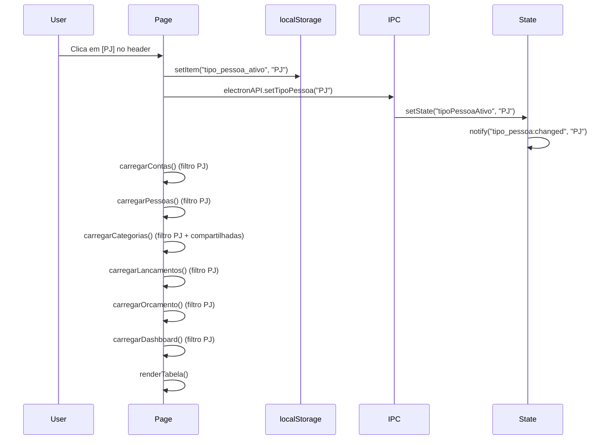
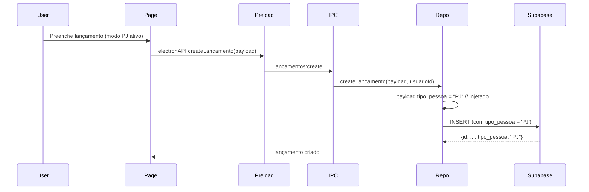
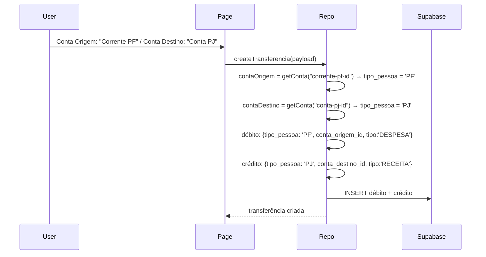

# SDD — Universos PF/PJ (Toggle de Tipo de Pessoa)

**Versão:** 2.0
**Data:** 20/06/2026
**Status:** Aprovado para implementação

---

## 1. Resumo Executivo

O usuário logado (cliente) poderá operar em **dois universos financeiros separados**: **PF (Pessoa Física)** — vida pessoal, e **PJ (Pessoa Jurídica)** — negócio.
Um toggle fixo no header alterna entre os modos. Cada universo possui suas próprias **contas**, **categorias**, **subcategorias**, **lançamentos**, **orçamentos** e **contatos**. Categorias/subcategorias podem ser **compartilhadas** entre os universos via toggle em Configurações. Transferências entre contas PF e PJ são **permitidas**.

---

## 2. Requisitos

| #   | Requisito                                                                    | Prioridade |
| --- | ---------------------------------------------------------------------------- | ---------- |
| R1  | Toggle fixo no header para alternar entre PF e PJ                            | Alta       |
| R2  | Modo selecionado persiste em `localStorage`                                  | Alta       |
| R3  | Cada conta pertence a um único universo (PF ou PJ)                           | Alta       |
| R4  | Cada lançamento/orçamento pertence a um único universo                       | Alta       |
| R5  | Categorias/subcategorias podem ser próprias de um universo OU compartilhadas | Alta       |
| R6  | Toggle em Config: "Compartilhar categorias entre PF e PJ"                    | Média      |
| R7  | Contatos (pessoas) separados por universo                                    | Alta       |
| R8  | Transferências PF ↔ PJ são permitidas (cross-universe)                       | Alta       |
| R9  | Dados existentes migram com default `'PF'`                                   | Alta       |

---

## 3. Modelo de Dados

### 3.1. Supabase (PostgreSQL) — Migração

#### `financas_categorias` — Nova coluna

```sql
ALTER TABLE financas_categorias
  ADD COLUMN tipo_pessoa TEXT CHECK (tipo_pessoa IN ('PF', 'PJ'))
  DEFAULT NULL;
```

> `NULL` = compartilhada entre PF e PJ
> `'PF'` = visível apenas no modo PF
> `'PJ'` = visível apenas no modo PJ

#### `financas_subcategorias` — Nova coluna

```sql
ALTER TABLE financas_subcategorias
  ADD COLUMN tipo_pessoa TEXT CHECK (tipo_pessoa IN ('PF', 'PJ'))
  DEFAULT NULL;
```

> Mesma regra: `NULL` = compartilhada.

#### `financas_contas` — Nova coluna

```sql
ALTER TABLE financas_contas
  ADD COLUMN tipo_pessoa TEXT NOT NULL DEFAULT 'PF'
    CHECK (tipo_pessoa IN ('PF', 'PJ'));
```

#### `financas_pessoas` — Nova coluna

```sql
ALTER TABLE financas_pessoas
  ADD COLUMN tipo_pessoa TEXT NOT NULL DEFAULT 'PF'
    CHECK (tipo_pessoa IN ('PF', 'PJ'));
```

#### `financas_lancamentos` — Nova coluna

```sql
ALTER TABLE financas_lancamentos
  ADD COLUMN tipo_pessoa TEXT NOT NULL DEFAULT 'PF'
    CHECK (tipo_pessoa IN ('PF', 'PJ'));
```

> **Nota:** Em transferências cross-universe (PF→PJ), o débito fica com `tipo_pessoa` da conta origem, o crédito com `tipo_pessoa` da conta destino.

#### `financas_orcamento` — Nova coluna

```sql
ALTER TABLE financas_orcamento
  ADD COLUMN tipo_pessoa TEXT NOT NULL DEFAULT 'PF'
    CHECK (tipo_pessoa IN ('PF', 'PJ'));
```

#### Índices

```sql
CREATE INDEX idx_lancamentos_tipo_pessoa ON financas_lancamentos (tipo_pessoa);
CREATE INDEX idx_orcamento_tipo_pessoa ON financas_orcamento (tipo_pessoa);
CREATE INDEX idx_contas_tipo_pessoa   ON financas_contas (tipo_pessoa);
CREATE INDEX idx_pessoas_tipo_pessoa  ON financas_pessoas (tipo_pessoa);
CREATE INDEX idx_categorias_tipo_pessoa ON financas_categorias (tipo_pessoa);
CREATE INDEX idx_subcategorias_tipo_pessoa ON financas_subcategorias (tipo_pessoa);
```

### 3.2. SQLite (cache offline) — Migração

Em `services/database.ts`, adicionar migrations:

```
v < 3 →
  ALTER TABLE financas_categorias ADD COLUMN tipo_pessoa TEXT DEFAULT NULL;
  ALTER TABLE financas_subcategorias ADD COLUMN tipo_pessoa TEXT DEFAULT NULL;
  ALTER TABLE financas_contas ADD COLUMN tipo_pessoa TEXT DEFAULT 'PF';
  ALTER TABLE financas_pessoas ADD COLUMN tipo_pessoa TEXT DEFAULT 'PF';
  ALTER TABLE financas_lancamentos ADD COLUMN tipo_pessoa TEXT DEFAULT 'PF';
  ALTER TABLE financas_orcamento ADD COLUMN tipo_pessoa TEXT DEFAULT 'PF';
```

### 3.3. Typescript — Tipos

```typescript
// src/types.d.ts

export interface Categoria {
  // ... campos existentes
  tipo_pessoa?: "PF" | "PJ" | null; // NOVO
}

export interface Subcategoria {
  // ... campos existentes
  tipo_pessoa?: "PF" | "PJ" | null; // NOVO
}

export interface Conta {
  // ... campos existentes
  tipo_pessoa: "PF" | "PJ"; // NOVO
}

export interface Pessoa {
  // ... campos existentes
  tipo_pessoa: "PF" | "PJ"; // NOVO
}

export interface Lancamento {
  // ... campos existentes
  tipo_pessoa?: "PF" | "PJ"; // NOVO
}

export interface Orcamento {
  // ... campos existentes
  tipo_pessoa?: "PF" | "PJ"; // NOVO
}

// Payloads
export type createContaPayload = {
  nome: string;
  tipo_pessoa: "PF" | "PJ"; // NOVO — obrigatório
};

export type createPessoaPayload = {
  nome: string;
  tipo_pessoa: "PF" | "PJ"; // NOVO — obrigatório
};
```

### 3.4. State

```typescript
// services/state.ts — adicionar
let state = {
  // ... campos existentes
  tipoPessoaAtivo: "PF" as "PF" | "PJ", // NOVO — modo atual do toggle
  compartilharCategorias: false, // NOVO — toggle de Config
};
```

---

## 4. Toggle no Header

### 4.1. UI

```
┌─────────────────────────────────────────────────────────┐
│  👤 Meu controle    [PF] [PJ]    R$ 5.000    R$ 3.000   │
│                                                          │
│            (todo o conteúdo filtra conforme o toggle)    │
└─────────────────────────────────────────────────────────┘
```

Dois botões/pills lado a lado no header:

- `[PF]` → ativo = fundo verde, inativo = outline
- `[PJ]` → ativo = fundo azul, inativo = outline

### 4.2. Persistência

- `localStorage.setItem("tipo_pessoa_ativo", "PF" | "PJ")`
- Toda página, ao carregar, lê do storage e aplica
- O estado também é enviado ao main process via `setState`

### 4.3. Efeito do Toggle

Ao alternar PF ↔ PJ:

1. Atualiza `localStorage` + `state.tipoPessoaAtivo`
2. Recarrega **todas** as entidades do novo modo:
   - `carregarContas()` com filtro `tipo_pessoa = novoModo`
   - `carregarPessoas()` com filtro `tipo_pessoa = novoModo`
   - `carregarCategorias()` com filtro (modo + compartilhadas se ativado)
   - `carregarLancamentos()` com filtro `tipo_pessoa = novoModo`
   - `carregarOrcamento()` com filtro `tipo_pessoa = novoModo`
   - `carregarDashboard()` com filtro `tipo_pessoa = novoModo`
3. Dispara `forceSync()` para garantir dados atualizados

---

## 5. Filtro Global por `tipo_pessoa`

### 5.1. Helper de Filtro

Em `services/repository/utils.ts`, criar:

```typescript
function addTipoPessoaFilter(query: any, tipoPessoa?: "PF" | "PJ", compartilhar?: boolean, coluna = "tipo_pessoa"): any {
  if (!tipoPessoa) return query;
  if (compartilhar) {
    // modo compartilhado: vê próprias + as NULL (compartilhadas)
    return query.or(`${coluna}.eq.${tipoPessoa},${coluna}.is.null`);
  }
  return query.eq(coluna, tipoPessoa);
}
```

### 5.2. Onde aplicar

| Função (repository) | Filtro | Compartilhado? |
|---|---|---|
| `getContas` | `eq("tipo_pessoa", modo)` | Não |
| `getPessoas` | `eq("tipo_pessoa", modo)` | Não |
| `getCategorias` | `eq` + `is.null` se compartilhado | Sim |
| `getSubcategorias` | `eq` + `is.null` se compartilhado | Sim |
| `getLancamentos` | `eq("tipo_pessoa", modo)` | Não |
| `getOrcamento` | `eq("tipo_pessoa", modo)` | Não |
| `getDashboard` | `eq("tipo_pessoa", modo)` | Não |
| `getAnosDisponiveis` | `eq("tipo_pessoa", modo)` | Não |
| `adminGetClientes` | `eq("tipo_pessoa", modo)` **ou** parâmetro opcional | Não |
| `adminGetTransacoesCliente` | Filtro opcional `tipo_pessoa` | N/A (admin escolhe) |
| `adminGetDashboardDadosCliente` | Filtro opcional `tipo_pessoa` | N/A (admin escolhe) |

### 5.3. Create/Update — Injeção automática

Em `createLancamento`, `createConta`, `createPessoa`, `createTransferencia`, `createOrcamento`:

```typescript
// Injetar o tipo_pessoa do estado atual
const payload = {
  ...dadosRecebidos,
  tipo_pessoa: getState("tipoPessoaAtivo"), // auto
};
```

Em `createCategoria`, `createSubcategoria`:

```typescript
// Se o toggle de compartilhar estiver ON, cria como NULL
// Se OFF, cria com o tipo_pessoa atual
const payload = {
  ...dadosRecebidos,
  tipo_pessoa: compartilharCategorias ? null : getState("tipoPessoaAtivo"),
};
```

---

## 6. Transferências Cross-Universe

### 6.1. Regra

Transferências **entre contas PF e PJ são permitidas**.

### 6.2. Implementação em `createTransferencia`

```typescript
async function createTransferencia(payload, usuarioId) {
  const grupoId = crypto.randomUUID();

  // Obter contas para descobrir os tipos
  const contaOrigem = await getConta(payload.conta_origem_id);
  const contaDestino = await getConta(payload.conta_destino_id);

  const tipoOrigem = contaOrigem?.tipo_pessoa || getState("tipoPessoaAtivo");
  const tipoDestino = contaDestino?.tipo_pessoa || getState("tipoPessoaAtivo");

  const base = {
    data: payload.data,
    status: payload.status,
    valor: payload.valor,
    categoria_id: payload.categoria_id,
    subcategoria_id: payload.subcategoria_id,
    pessoa_id: payload.pessoa_id || null,
    descricao: payload.descricao || null,
    transferencia_grupo_id: grupoId,
  };

  // Débito — tipo_pessoa da conta origem
  const debito = {
    ...base,
    tipo: "DESPESA",
    tipo_pessoa: tipoOrigem,
    conta_origem_id: payload.conta_origem_id || null,
    conta_destino_id: null,
  };

  // Crédito — tipo_pessoa da conta destino
  const credito = {
    ...base,
    tipo: "RECEITA",
    tipo_pessoa: tipoDestino,
    conta_origem_id: null,
    conta_destino_id: payload.conta_destino_id || null,
  };

  // ... insert (mesmo fluxo atual)
}
```

### 6.3. Implicação no Dashboard

O dashboard por padrão mostra dados do **universo atual**.
Para ver o consolidado, o usuário alterna o toggle.

---

## 6.4. Páginas Afetadas pelo Toggle

O toggle PF/PJ é replicado no header de **todas as páginas do sistema** e afeta diretamente os dados exibidos:

### 6.4.1. `public/index.html` — Lançamentos
- Toggle no header
- `carregarContas()` com filtro `tipo_pessoa`
- `carregarCategorias()` com filtro (+ compartilhadas)
- `carregarPessoas()` com filtro `tipo_pessoa`
- `carregarLancamentos()` com filtro `tipo_pessoa`
- Formulário de lançamento herda `tipo_pessoa` do toggle automaticamente

### 6.4.2. `public/dashboard.html` — Dashboard Financeiro
- Toggle no header
- `carregarDashboard()` → `getDashboard(chave)` filtra por `tipo_pessoa`
- `popularAnos()` → `getAnosDisponiveis()` filtra por `tipo_pessoa`
- Todos os 3 gráficos (Receitas vs Despesas, Gastos por Categoria, Evolução do Saldo) usam apenas dados do universo ativo
- Filtros de ano/mês/categoria já existentes continuam funcionando em conjunto

### 6.4.3. `public/visualizar-cliente.html` — Admin: Lançamentos do Cliente
- Header sem toggle (é admin vendo dados de outro usuário)
- Adicionar badge/indicador de `tipo_pessoa` nos lançamentos (PF/PJ)
- Pode exibir filtro por tipo_pessoa para o admin visualizar

### 6.4.4. `public/visualizar-dashboard-cliente.html` — Admin: Dashboard do Cliente
- Header sem toggle
- Adicionar filtro por `tipo_pessoa` (PF/PJ/Ambos) nos selects
- Gráficos exibem dados filtrados pelo tipo selecionado

### 6.4.5. `public/configuracoes.html` — Configurações
- **Subseção "Categorias"**: Novo campo `tipo_pessoa` na tabela de categorias; toggle "Compartilhar entre PF e PJ" no topo
- **Subseção "Contas"**: Criar conta herda `tipo_pessoa` do toggle atual; exibir coluna PF/PJ na tabela
- **Subseção "Pessoas"**: Criar pessoa herda `tipo_pessoa` do toggle atual; exibir coluna PF/PJ na tabela

### 6.4.6. `public/admin.html` — Admin: Clientes
- Na listagem de clientes (`adminGetClientes`), filtrar por `tipo_pessoa`
- Exibir badge PF/PJ ao lado do nome de cada cliente
- Filtro por tipo nos selects do admin

---

## 7. Compartilhamento de Categorias (Config)

### 7.1. Toggle em Configurações

```
┌──────────────────────────────────────┐
│ Categorias                           │
│                                      │
│ [Compartilhar categorias PF/PJ] [ON] │
│                                      │
│ Quando ON: categorias sem tipo       │
│ específico aparecem nos dois modos.  │
└──────────────────────────────────────┘
```

### 7.2. Efeito

- Armazenado em `localStorage("compartilhar_categorias", "true"|"false")`
- Sincronizado com `state`
- Aplicado em `getCategorias`, `getSubcategorias`, e nos creates

---

## 8. Arquivos a Modificar

### 8.1. Main Process (TypeScript)

| Arquivo | Mudança |
|---|---|
| `services/database.ts` | Migrations v3 (6x ALTER TABLE) |
| `services/repository/utils.ts` | Helper `addTipoPessoaFilter` |
| `services/repository/contas.ts` | Filtrar por `tipo_pessoa`; injetar no create |
| `services/repository/pessoas.ts` | Filtrar por `tipo_pessoa`; injetar no create |
| `services/repository/categorias.ts` | Filtrar com compartilhamento; injetar no create |
| `services/repository/lancamentos.ts` | Filtrar por `tipo_pessoa`; cross-universe em transferência |
| `services/repository/admin.ts` | Filtrar por `tipo_pessoa` nas queries admin |
| `services/state.ts` | `tipoPessoaAtivo` + `compartilharCategorias` |
| `services/ipcHandlers.ts` | Handler para `setTipoPessoa` + `getTipoPessoa` |
| `preload.ts` | Expor `setTipoPessoa`, `getTipoPessoa`, `onTipoPessoaChanged` |
| `src/types.d.ts` | Novos campos `tipo_pessoa` nas interfaces |

### 8.2. Renderer (HTML)

| Arquivo | Mudança |
|---|---|
| `public/index.html` | Toggle PF/PJ no header |
| `public/dashboard.html` | Toggle PF/PJ no header |
| `public/configuracoes.html` | Toggle compartilhar categorias na subseção categorias; coluna PF/PJ em contas e pessoas |
| `public/admin.html` | Filtro PF/PJ na listagem de clientes; coluna Tipo na tabela |
| `public/visualizar-cliente.html` | Badge PF/PJ nos lançamentos; filtro por tipo |
| `public/visualizar-dashboard-cliente.html` | Filtro PF/PJ + badge nos gráficos |

### 8.3. Renderer (JavaScript ESM)

| Arquivo | Mudança |
|---|---|
| `public/js/index.js` | Lógica do toggle + recarregar dados; contas/pessoas/categorias filtradas |
| `public/js/dashboard.js` | Ler `tipo_pessoa_ativo` do localStorage; passar para `getDashboard`; recarregar ao alternar toggle |
| `public/js/configuracoes.js` | Toggle compartilhar categorias; CRUD de contas/pessoas com `tipo_pessoa` injetado; exibir coluna PF/PJ |
| `public/js/admin.js` | Filtro PF/PJ na listagem; exibir badge; filtrar admin queries |
| `public/js/visualizar-cliente.js` | Exibir `tipo_pessoa` nos lançamentos; filtro por tipo |
| `public/js/visualizar-dashboard-cliente.js` | Filtro PF/PJ nos gráficos do admin |
| `public/js/auth-guard.js` | Restaurar `tipo_pessoa_ativo` do localStorage após login |

---

## 9. Fluxo de Dados

### 9.1. Toggle PF/PJ



### 9.2. Criação de Lançamento (modo PJ)



### 9.3. Transferência Cross-Universe (PF→PJ)



---

## 10. Alterações por Página

### 10.1. `index.html` — Lançamentos

- **Header**: toggle `[PF] [PJ]` ao lado do avatar
- **Formulário**: selects de conta, categoria, subcategoria e pessoa filtrados pelo modo atual
- **Payload**: `tipo_pessoa` injetado automaticamente ao criar/editar lançamento ou transferência
- **Tabela**: exibe apenas lançamentos do modo atual
- **Resumo/Dashboard lateral**: filtrado pelo modo atual

### 10.2. `dashboard.html` — Dashboard Financeiro

- **Header**: toggle `[PF] [PJ]` replicado
- **Dados**: `getDashboard(chave)` recebe parâmetro extra `tipo_pessoa`; retorna dados filtrados
- **Gráficos**: todos os 3 gráficos (mensal, categorias, saldo) recarregam ao alternar o toggle
- **Filtros existentes**: ano, mês e categoria continuam funcionando em conjunto com o toggle

### 10.3. `configuracoes.html` — Configurações

#### Subseção Categorias
- Novo toggle no topo: "Compartilhar categorias entre PF e PJ"
- Tabela de categorias ganha coluna `Tipo` (PF / PJ / Compartilhada)
- Criação de categoria: se toggle OFF → herda tipo do modo atual; se ON → cria como Compartilhada (NULL)
- Edição: permite alterar `tipo_pessoa` da categoria

#### Subseção Contas
- Tabela de contas ganha coluna `Tipo` (PF / PJ)
- Criação de conta herda `tipo_pessoa` do toggle ativo no momento
- Campo `tipo_pessoa` aparece no formulário inline (read-only, reflete o modo atual)

#### Subseção Pessoas
- Tabela de pessoas ganha coluna `Tipo` (PF / PJ)
- Criação de pessoa herda `tipo_pessoa` do toggle ativo no momento

### 10.4. `admin.html` — Admin

- Listagem de clientes ganha coluna `Tipo` (PF / PJ)
- Filtro por tipo_pessoa no select "Status" → adicionar opção "PF" e "PJ"
- Resumo e detalhes do cliente filtrados por tipo_pessoa

### 10.5. `visualizar-cliente.html` — Admin: Lançamentos do Cliente

- Tabela de lançamentos ganha coluna `Tipo` (PF / PJ)
- Filtro por tipo_pessoa nos pills (Todos / PF / PJ)
- Badge colorido indicando PF (verde) ou PJ (azul)

### 10.6. `visualizar-dashboard-cliente.html` — Admin: Dashboard do Cliente

- Filtro extra: `Tipo` com opções `[Todos] [PF] [PJ]`
- Gráficos recarregam com base no tipo selecionado
- Se "Todos", consolida PF + PJ

---

## 11. Backward Compatibility

### 11.1. Dados existentes

Todas as linhas existentes recebem:

- `tipo_pessoa = 'PF'` (default na migração)

### 11.2. Migração de dados

Para quem já tem PF e PJ misturados, uma rota manual no admin permite reclassificar em lote (fora do escopo desta sprint).

### 11.3. UI

Toggle default = `'PF'`. Usuários existentes não percebem mudança até clicar no PJ.

---

## 12. Wireframe do Toggle

```
┌─────────────────────────────────────────────────────────────┐
│  👤 F                         PF  PJ   ▶ Config  ▶ Sair   │
│      Meu controle financeiro.                               │
│  ─────────────────────────────────────────────────────────  │
│  Receitas: R$ 5.000     Despesas: R$ 3.000     Saldo: +R$   │
│                                                             │
│  ┌──────────────┐  ┌──────────────────────────────────────┐ │
│  │ Lançamento   │  │ Visão rápida do mês                  │ │
│  │ rápido       │  │ Planejado vs Realizado               │ │
│  │              │  │                                      │ │
│  │ Data [   ]   │  │ Receitas  Planejado R$  Real. R$     │ │
│  │ Tipo [   ]   │  │ Despesas  Planejado R$  Real. R$     │ │
│  │ ...          │  │                                      │ │
│  │ Conta [▼]    │  │ Resumo: R$ +2.000                    │ │
│  │ Pessoa [▼]   │  │                                      │ │
│  └──────────────┘  └──────────────────────────────────────┘ │
└─────────────────────────────────────────────────────────────┘
```

O toggle `PF` / `PJ` fica no header, ao lado do avatar.
Quando ativo, o botão correspondente fica destacado com cor.

### Dashboard com Toggle

```
┌──────────────────────────────────────────────────────────┐
│  👤 F          PF  PJ     ▶ Voltar  ▶ Config  ▶ Sair    │
│                                                          │
│  Ano [2026 ▼]  Mês [all ▼]  Categoria [Todas ▼]         │
│                                                          │
│  ┌─────────────────────┐  ┌────────────────────────┐     │
│  │ Receitas vs Desp.   │  │ Gastos por Categoria   │     │
│  │   📊 (gráfico PF)   │  │   🥧 (gráfico PF)      │     │
│  └─────────────────────┘  └────────────────────────┘     │
│  ┌──────────────────────────────────────────────────┐    │
│  │ Evolução do Saldo                                │    │
│  │   📈 (gráfico PF)                                │    │
│  └──────────────────────────────────────────────────┘    │
└──────────────────────────────────────────────────────────┘
```

### Admin — Visualizar Cliente

```
┌──────────────────────────────────────────────────────────┐
│  🔧 Admin              ▶ Voltar  ▶ Dashboard  ▶ Sair    │
│                                                          │
│  Cliente: João Silva                                     │
│                                                          │
│  Tipo: [Todos ▼]  Ano [2026 ▼]  Mês [all ▼]             │
│                                                          │
│  | Data    | Tipo          | Descrição   | Valor  | PF/PJ│
│  | 01/06   | DESPESA       | Aluguel     | 1.500  |  PF  │
│  | 05/06   | RECEITA       | Salário     | 5.000  |  PF  │
│  | 10/06   | DESPESA       | Insumos     | 2.000  |  PJ  │
└──────────────────────────────────────────────────────────┘
```

---

## 13. Plano de Implementação

| Fase | Tarefas | Esforço |
|---|---|---|
| **1** | Migration Supabase + SQLite (6 colunas + índices) | 2h |
| **2** | Helper `addTipoPessoaFilter` + state `tipoPessoaAtivo` | 2h |
| **3** | Repository: filtrar contas, pessoas, categorias por `tipo_pessoa` | 3h |
| **4** | Repository: filtrar lancamentos, orçamento, dashboard; cross-universe | 3h |
| **5** | Repository admin: filtrar queries admin por tipo_pessoa | 1h |
| **6** | Toggle PF/PJ no header (`index.html` + `dashboard.html`) | 3h |
| **7** | `dashboard.js`: integrar toggle + recarregar gráficos | 2h |
| **8** | `configuracoes.js`: toggle compartilhar categorias + coluna PF/PJ em contas/pessoas | 3h |
| **9** | `admin.js` + `visualizar-cliente.js`: filtro PF/PJ, badge nas tabelas | 2h |
| **10** | `visualizar-dashboard-cliente.js`: filtro PF/PJ nos gráficos admin | 1h |
| **11** | Atualizar testes unitários/integrados/E2E | 4h |
| **Total** | | **26h** |

---

## 14. Aprovação e Checklist de Páginas

### 14.1. Checklist de Páginas Afetadas

| Página | Toggle PF/PJ | Filtro tipo_pessoa | Badge/Tipo na UI | CRUD herda tipo |
|---|---|---|---|---|
| `index.html` | ✅ Header | ✅ Lançamentos, contas, categorias | — | ✅ Lançamentos |
| `dashboard.html` | ✅ Header | ✅ Gráficos | — | — |
| `configuracoes.html` | — | ✅ Categorias, contas, pessoas | ✅ Tabelas | ✅ Categorias, contas, pessoas |
| `admin.html` | — | ✅ Clientes | ✅ Coluna Tipo | — |
| `visualizar-cliente.html` | — | ✅ Lançamentos do cliente | ✅ Coluna PF/PJ | — |
| `visualizar-dashboard-cliente.html` | — | ✅ Gráficos do cliente | ✅ Filtro PF/PJ | — |

### 14.2. Roteiro de Testes por Página

1. **index**: alternar toggle → recarregar tudo; criar lançamento PF → alternar → não ver; transferência PF↔PJ
2. **dashboard**: alternar toggle → gráficos mudam; dados PF vs PJ diferentes
3. **configuracoes**: toggle compartilhar ON → categorias NULL aparecem nos 2 modos; criar conta no modo PJ → só visível no PJ
4. **admin**: filtro PF/PJ na listagem; badge correto; visualizar cliente filtrado
5. **visualizar-cliente**: coluna PF/PJ; filtro por tipo; dados corretos
6. **visualizar-dashboard-cliente**: filtro PF/PJ afeta gráficos

---

## 15. Riscos e Mitigações

| Risco                                          | Mitigação                                                             |
| ---------------------------------------------- | --------------------------------------------------------------------- |
| Performance com 2 universos                    | Índices em `tipo_pessoa` em todas as tabelas                          |
| Confusão do usuário ao alternar                | Indicador visual claro (cor diferente PF/PJ)                          |
| Transferência cross-universe quebra relatórios | Dashboard já filtra por modo; consolidado é feito alternando o toggle |
| Categorias compartilhadas vs próprias confusas | Tooltip explicativo no toggle de Config                               |
| Sync offline com novo campo                    | `tipo_pessoa` incluído nas entidades sincronizadas                    |
